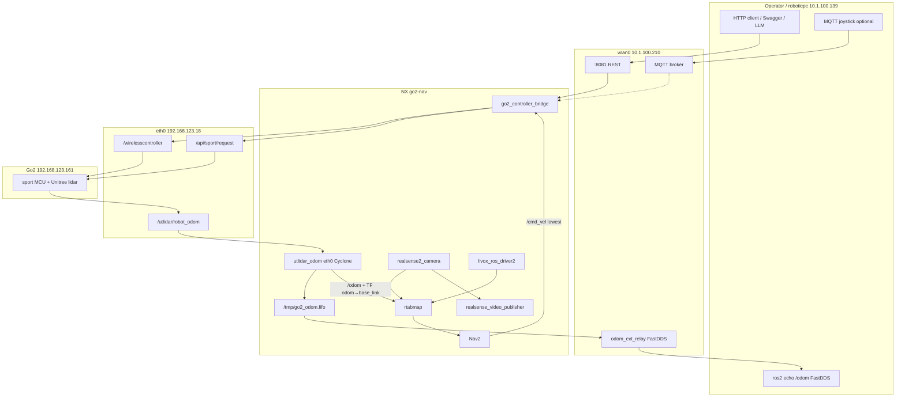

# Architecture

NX (`unitree`, Humble) sits between the Go2 MCU (eth0) and operator machines (wlan).
**Never put Unitree eth0 traffic and the external Wi‑Fi DDS bus in one Cyclone participant.**

## System



## Buses

| Bus | NIC | RMW / profile | Traffic |
|-----|-----|---------------|---------|
| Unitree dog | eth0 `192.168.123.18` | Cyclone `cyclonedds.go2.xml` / `cyclonedds.eth0.xml` | `/utlidar/*`, `/wirelesscontroller`, `/api/sport/request` |
| External odom | all NICs / FastDDS `fastrtps.odom-ext.xml` | `odom_ext_relay` | `/odom`, TF, `/odom_ext_relay/reset` |
| RealSense | dedicated Cyclone `cyclonedds.realsense.xml` | RGB-D | camera topics |
| Operator HTTP | wlan TCP `:8081` | not DDS | teleop + calib |
| MQTT | TCP broker | optional joystick | lower than HTTP |

Split odom (`go2-odom.service`): `utlidar_odom` (eth0 only) → named pipe → `odom_ext_relay` (FastDDS). One participant on eth0+wlan breaks Unitree SPDP; `/utlidar/robot_odom` goes silent.

## Control (operator = HTTP)

Priority **REST → MQTT → Nav**. Higher source applies immediately; lower msgs are dropped. Hold `mqtt_timeout_sec` (1 s) after the last higher msg.

| Source | API | Onto the dog |
|--------|-----|----------------|
| REST sticks | `POST /wireless` | `/wirelesscontroller` held at 50 Hz |
| REST speed | `POST /cmd_vel` | sport Move `1008` (StopMove `1003` on stop) |
| MQTT | JSON sticks | `/wirelesscontroller` |
| Nav2 | `/cmd_vel` Twist | `/wirelesscontroller` |

Docs: [go2_controller.md](go2_controller.md).

## Perception / localization

Livox mapping stack (`startup/tmux.livox.mapping.sh`):

| Pane / unit | Role |
|-------------|------|
| `go2-odom.service` | `/utlidar/robot_odom` → `/odom` + TF `odom`→`base_link` |
| main.0 `run_go2_controller.sh` | HTTP + mux → dog |
| main.1 video publisher | JPEG/stream for remote |
| main.2 RealSense | RGB-D |
| main.3 RTAB-Map mapping | map from RGB-D + Livox cloud; odom = `/odom` (not ICP `/vo`) |
| livox window | MID-360 driver |

Nav stack (`tmux.livox.nav.sh`) adds Nav2; RTAB location launch; Nav2 `/cmd_vel` is lowest priority into the controller.

Odom docs: [../startup/01_odom/readme.md](../startup/01_odom/readme.md).

## Frames / topics (nav path)

```text
Unitree lidar pose  →  /utlidar/robot_odom
                    →  /odom  +  TF odom → base_link
RTAB-Map            →  map → odom  (when localized)
Nav2                →  /cmd_vel
controller          →  /wirelesscontroller  or  sport Move
```

RTAB livox mapping/location uses external `/odom` (`subscribe_odom_info: false`). `/odom` stamps use NX ROS time so TF is not ~50 min behind the camera.

## Startup

| Entry | What |
|-------|------|
| `startup/01_odom/install.sh` | systemd `go2-odom.service` at boot |
| `startup/run_go2_controller.sh` | controller + `cyclonedds.go2.xml` |
| `startup/tmux.livox.mapping.sh` | mapping bringup |
| `startup/tmux.livox.nav.sh` | localization + Nav2 |
