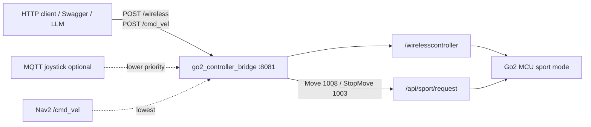

# Go2 controller

System context: [architecture.md](architecture.md).

Operator API is **HTTP REST** on the NX. The dog still only consumes Unitree DDS
(`rt/wirelesscontroller` as ROS `/wirelesscontroller`, and `/api/sport/request`).

Interactive Swagger UI (after the node is up):

```text
http://<nx-ip>:8081/docs
```

On this robot, WLAN is typically `10.1.100.210`, so `http://10.1.100.210:8081/docs`.

Package: `src/go2_controller`  
Node: `go2_controller_bridge.py`  
Launch: `ros2 launch go2_controller go2_controller.launch.py`  
Startup wrapper: `startup/run_go2_controller.sh` (sets CycloneDDS `cyclonedds/cyclonedds.go2.xml`)

## Architecture



Do **not** mix stick teleop and sport Move at the same time. `/wireless` is joystick.
`/cmd_vel` is SI speed via sport Move. Unitree firmware also has its own
`/wirelesscontroller` publishers (bare DDS); the bridge holds the last REST stick
command at `publish_rate` (50 Hz) so those zeros do not jerk the motors.

## Priority

High → low. Higher source applies immediately. Lower messages are **dropped**
(not queued). After the last higher-priority message, wait `mqtt_timeout_sec`
(default **1 s**) before a lower source may drive.

| Rank | Source | Into the dog | If a higher source is active |
|------|--------|--------------|------------------------------|
| 1 | HTTP `POST /wireless` | `/wirelesscontroller` (held at 50 Hz) | — |
| 1 | HTTP `POST /cmd_vel` | sport `Move` 1008 | — |
| 2 | MQTT JSON | `/wirelesscontroller` | ignored |
| 3 | ROS `/cmd_vel` (Nav2) | `/wirelesscontroller` | ignored (not published) |

Idle: if nothing new from REST, MQTT, or Nav for `input_idle_timeout_sec` (default 1 s),
publish **one** all-zero `WirelessController`, then pause.

`StopMove` (1003) is sent only for `POST /cmd_vel/stop`, when a timed `/cmd_vel`
ends, or when a running sport hold is preempted. It is **not** sent on every
`/wireless` tick.

## Build

From repo root (bash, not zsh, for `setup.bash`):

```bash
bash --noprofile --norc -c 'source /opt/ros/humble/setup.bash && colcon build --symlink-install --packages-select go2_controller'
```

## Run

Preferred (eth0 + wlan Cyclone profile for the dog):

```bash
cd /home/unitree/go2-nav/startup && ./run_go2_controller.sh
```

Livox mapping tmux already starts this in **main.0**:

```bash
cd /home/unitree/go2-nav/startup && ./tmux.livox.mapping.sh
```

After a code change, rebuild, then Ctrl-C only that pane and run `./run_go2_controller.sh` again.
Do not restart the whole tmux stack.

After sourcing `install/setup.bash` + the same `CYCLONEDDS_URI`:

```bash
ros2 launch go2_controller go2_controller.launch.py
ros2 launch go2_controller go2_controller.launch.py rest_port:=8081 mqtt_broker:=10.1.106.210
```

Check the API:

```bash
curl -s http://127.0.0.1:8081/health
curl -s http://127.0.0.1:8081/openapi.json | head
```

## REST API

Bind: `rest_host` / `rest_port` (default `0.0.0.0:8081`).

| Method | Path | Description |
|--------|------|-------------|
| `POST` | `/wireless` | Joystick → `/wirelesscontroller`. |
| `POST` | `/cmd_vel` | Sport Move: `{vx,vy,w}` m/s and rad/s. Optional `duration`. |
| `POST` | `/cmd_vel/stop` | Sport StopMove. |
| `GET` | `/calib` | Current `/cmd_vel` scales. |
| `POST` | `/calib` | Set scales JSON (`vx` / `vy` / `w`, any key optional). |
| `POST` | `/calib/vx/{scale}` | Set forward scale. |
| `POST` | `/calib/vy/{scale}` | Set lateral scale. |
| `POST` | `/calib/w/{scale}` | Set yaw scale. |
| `GET` | `/health` | Liveness. |
| `GET` | `/nav2/status` | Current Nav2 goal, feedback, and result. |
| `GET` | `/nav2/goal` | Current Nav2 goal payload and status. |
| `POST` | `/nav2/goal` | Send `{x, y, yaw, frame_id}` to Nav2 `NavigateToPose`. |
| `POST` | `/nav2/cancel` | Cancel the active Nav2 goal. |
| `GET` | `/nav2/pose` | Current robot pose from TF (`map` → `base_link`). |
| `POST` | `/nav2/pose` | Set localization pose via `/initialpose`. |
| `POST` | `/nav2/clear_local_costmap` | Clear the entire local costmap. |
| `GET` | `/docs` | Swagger UI. |
| `GET` | `/openapi.json` | OpenAPI 3 schema. |

MQTT is lower priority, so REST is not 409-blocked by MQTT. Nav `/cmd_vel` is
dropped while REST (or MQTT) is active.

The Swagger example for `POST /nav2/goal` targets the configured `main door`
pose from `app_go2/destinations.yaml`.

```bash
curl -s -X POST http://127.0.0.1:8081/nav2/clear_local_costmap
```

### `POST /wireless`

```json
{ "lx": 0.0, "ly": 0.2, "rx": 0.0, "ry": 0.0, "keys": 0 }
```

| Field | Stick | Typical use |
|-------|--------|-------------|
| `lx` | left X | strafe |
| `ly` | left Y | forward / back |
| `rx` | right X | yaw |
| `ry` | right Y | unused by most teleop |
| `keys` | uint16 | button bitmask (e.g. L2+A → 288) |

```bash
curl -s -X POST http://127.0.0.1:8081/wireless \
  -H 'Content-Type: application/json' \
  -d '{"lx":0.0,"ly":0.2,"rx":0.0,"ry":0.0,"keys":0}'
```

Stream sticks at ~10–50 Hz from the client. The bridge also republishes the last
non-expired command at `publish_rate` until `mqtt_timeout_sec` of silence.

### `POST /cmd_vel` (sport Move)

SI command, then `send = command × scale`. Defaults: **vx×0.85**, **vy×1.25**, **w×1.25**.

```bash
# 0.2 m/s × 0.85 → 0.17 m/s for 5 s, then StopMove
curl -s -X POST http://127.0.0.1:8081/cmd_vel \
  -H 'Content-Type: application/json' \
  -d '{"vx":0.2,"vy":0.0,"w":0.0,"duration":5.0}'

# Hold until stop
curl -s -X POST http://127.0.0.1:8081/cmd_vel \
  -H 'Content-Type: application/json' \
  -d '{"vx":0.15,"vy":0.0,"w":0.0}'

curl -s -X POST http://127.0.0.1:8081/cmd_vel/stop
```

`w` and `wz` are aliases (yaw rad/s). `vz` / `wx` / `wy` are accepted and ignored.

### Calibration

```bash
curl -s http://127.0.0.1:8081/calib
curl -s -X POST http://127.0.0.1:8081/calib/vx/0.85
curl -s -X POST http://127.0.0.1:8081/calib \
  -H 'Content-Type: application/json' \
  -d '{"vx":0.85,"vy":1.25,"w":1.25}'
```

Launch-time overrides (no HTTP):

```bash
ros2 launch go2_controller go2_controller.launch.py \
  cmd_vel_scale_vx:=0.85 cmd_vel_scale_vy:=1.25 cmd_vel_scale_w:=1.25
```

## MQTT (optional, lower priority)

JSON same shape as `/wireless`, default topic `/wirelesscontroller`, broker
`mqtt_broker` (launch default `10.1.106.210:1883`).

Dropped entirely while REST has been active within `mqtt_timeout_sec`.

Joystick helper on another machine: `joystick_controller/joystick_mqtt.py`.
Leave transmit **off** (or stop the publisher) when driving over HTTP, or MQTT
zeros will take over 1 s after the last REST call.

## Nav2 `/cmd_vel`

Lowest priority. Twist (SI) → sticks uses the same vlaa calib as REST sport Move:

`stick = si × scale` (no clamp) with defaults **vx×0.85**, **vy×1.25**, **w×1.25**.

| Twist | Stick | Default |
|-------|--------|---------|
| `linear.x` | `ly = vx × scale_vx` | ×0.85 |
| `linear.y` | `lx = ±vy × scale_vy` | ×1.25; sign flip if `invert_cmd_vel_lateral` |
| `angular.z` | `rx = -wz × scale_w` | ×1.25 |

Tune online with `GET/POST /calib` (shared with sport Move).

Watch Nav2 / test Twist live (same Cyclone as Nav):

```bash
./scripts/print_cmd_vel.sh
```

## Motion test script

`scripts/test_controller_move.sh` drives six body-frame motions so you can check
sign and scale without Nav2:

| `--action` | ROS command | Expected motion |
|------------|-------------|-----------------|
| `forward` | `+vx` | Walk forward |
| `backward` | `-vx` | Walk backward |
| `left` | `+vy` | Strafe left |
| `right` | `-vy` | Strafe right |
| `turn_left` | `+wz` | Yaw CCW |
| `turn_right` | `-wz` | Yaw CW (clockwise from above) |

Defaults: **0.4 m** at **0.2 m/s**, **90°** at **0.5 rad/s**, **2 s** countdown,
**1.5 s** pause between steps. `--action all` (default) runs the six in order.

```bash
# Cancel any Nav2 goal first. Clear space around the dog.
cd /home/unitree/go2-nav

# All six motions
./scripts/test_controller_move.sh

# Forward / left / right / turn
./scripts/test_controller_move.sh --action forward --distance 1.0 --v 0.2
./scripts/test_controller_move.sh --action left --distance 0.4 --v 0.2
./scripts/test_controller_move.sh --action right --distance 0.4 --v 0.2
./scripts/test_controller_move.sh --action turn_left --angle 90 --w 0.5
./scripts/test_controller_move.sh --action turn_right --angle 90 --w 0.5

./scripts/test_controller_move.sh --via rest
./scripts/test_controller_move.sh --via wireless
```

| `--via` | Path |
|---------|------|
| `ros` (default) | Publish `/cmd_vel` Twist — same path as Nav2 → sticks |
| `rest` | `POST /cmd_vel` sport Move (uses `cmd_vel_scale_*`) |
| `wireless` | `POST /wireless` with the same SI→stick map as the bridge |

`--via ros` uses `scripts/setup.sh` Cyclone (`cyclonedds.xml`), matching Nav2.
REST/wireless only need the controller HTTP API on `:8081`.

`scripts/test_controller_rotate.sh` is a wrapper for `--action turn_right`.

Ctrl-C sends a stop (zero Twist, `/cmd_vel/stop`, or zero sticks). Duration is
`distance/v` or `angle/w` with **no accel ramp**, so the dog may travel a bit
less than commanded.

## Launch / node parameters

| Parameter | Default | Meaning |
|-----------|---------|---------|
| `rest_enable` | `true` | Serve HTTP API. |
| `rest_host` | `0.0.0.0` | Bind address. |
| `rest_port` | `8081` | Bind port. |
| `ros2_topic` | `/wirelesscontroller` | DDS stick output. |
| `cmd_vel_topic` | `/cmd_vel` | Nav2 Twist input. |
| `mqtt_broker` | `10.1.106.210` | MQTT host. |
| `mqtt_port` | `1883` | MQTT port. |
| `mqtt_topic` | `/wirelesscontroller` | MQTT subscribe topic. |
| `mqtt_timeout_sec` | `1.0` | Hold after last higher-priority message. |
| `publish_rate` | `50.0` | Hold / Nav republish Hz. |
| `input_idle_timeout_sec` | `1.0` | One zero then pause; `0` disables. |
| `cmd_vel_scale_vx` / `_vy` / `_w` | `0.85` / `1.25` / `1.25` | REST sport Move and Nav `/cmd_vel`→stick. |
| `invert_cmd_vel_lateral` | `true` | Flip Nav `linear.y` → `lx`. |
| `log_each_rest_request` | `true` | Log HTTP apply. |
| `log_each_mqtt_message` | `true` | Log each MQTT JSON. |
| `log_each_wireless_publish` | `true` | Log DDS stick publish (holds are quiet). |
| `log_each_nav_publish` | `false` | Log Nav→stick. |
| `log_idle_zero_publish` | `false` | Log idle zero. |

## DDS

`startup/run_go2_controller.sh` sets:

```bash
export RMW_IMPLEMENTATION=rmw_cyclonedds_cpp
export CYCLONEDDS_URI=file://$PROJECT/cyclonedds/cyclonedds.go2.xml
```

The dog is on **eth0** (`192.168.123.x`). Keep that interface in the Cyclone
profile or `/wirelesscontroller` never reaches sport mode.

Expect extra Unitree `_CREATED_BY_BARE_DDS_APP_` publishers on
`/wirelesscontroller`. That is normal. Do not run a second ROS node that also
publishes the same topic.

## Dependencies

ROS: `rclpy`, `unitree_go`, `unitree_api`, `geometry_msgs`  
Python: `paho-mqtt`, `starlette`, `uvicorn`

## Troubleshooting

| Symptom | Likely cause |
|---------|----------------|
| Motors jerk while holding a stick / HTTP `v` | Another writer on `/wirelesscontroller` (Unitree remote or MQTT zeros). Confirm `source=rest` in logs; stop MQTT transmit; put Unitree app/remote down. |
| HTTP `/wireless` does nothing | Node not using `cyclonedds.go2.xml` / eth0; or sport mode not entered. |
| `/cmd_vel` sport Move jerks | Mixing with `/wireless` or Unitree stick zeros. Use one path. |
| Swagger empty / connection refused | Controller pane down; check `curl :8081/health`. |
| Nav does not move the dog | REST or MQTT still inside the 1 s hold. |
| `colcon` / `setup.bash` fails under zsh | Use `bash --noprofile --norc -c 'source …'`. |
