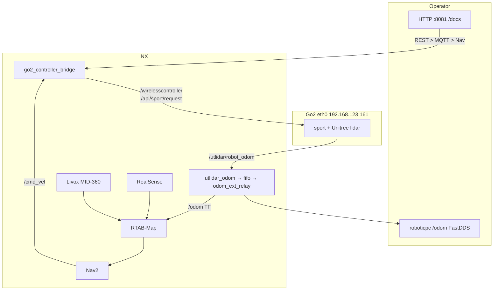

# Architecture

NX Humble between the Go2 MCU (**eth0**) and operators (**wlan**). Do not put both NICs in one Cyclone participant — Unitree SPDP dies and `/utlidar/robot_odom` never arrives.

Full write-up: [docs/architecture.md](docs/architecture.md).

| Layer | Path |
|-------|------|
| Teleop | HTTP `POST /wireless` or `/cmd_vel` → DDS to dog |
| Odom | `/utlidar/robot_odom` → `/odom` + `odom`→`base_link` (split DDS + pipe) |
| Map | RealSense RGB-D + Livox cloud + `/odom` → RTAB-Map |
| Nav | Nav2 `/cmd_vel` → controller (lowest priority) |

## Docs

- [Architecture](docs/architecture.md)
- [Go2 controller](docs/go2_controller.md)
- [Odom startup](startup/01_odom/readme.md)
- [RTAB topics](docs/rtab.md)
